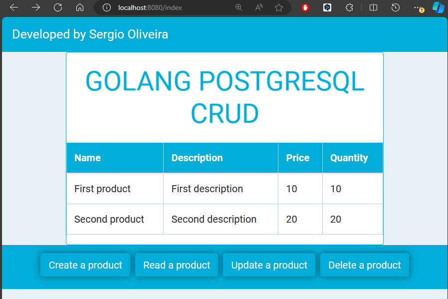

# Golang-CRUD
Repository dedicated to a simple Golang project to contextualize CRUD operations, using PostgreSQL
---------------------------------------------------------------------------------------------------

  

# Online Store

This is a simple online store project implemented in Go.

## About the Project

This project is a simple online store that allows users to view, create,read, update, and delete products.

## Technologies Used

- Go
- PostgreSQL (via `github.com/lib/pq` package)
- HTML (for the views)

## Project Structure

The project is divided into four main packages:

- `main`: This is the entry point of the application. It sets up the HTTP server, connects to the database, and loads the routes.
- `routes`: This package contains the application's routes. It uses the `html/template` package to render the views.
- `models`: This package contains the data model definition.
- `controllers`: This package contains the controllers that handle HTTP requests and return responses.
- `views`: This package is responsible for rendering the HTML that is sent to the client.

## Models

Models are used to represent the data that the application will handle. In this project, we have one model:

- `Produtos`: This model represents a product in the store. It has the following fields:
  - `Id`: The primary key of the product.
  - `Nome`: The name of the product.
  - `Descricao`: A description of the product.
  - `Preco`: The price of the product.
  - `Quantidade`: The quantity of the product in stock.

Each model has associated methods for interacting with the database:

- `Create`: This method inserts a new product into the database.
- `Read`: This method reads a specific product from the database.
- `ReadAll`: This method reads all products from the database.
- `Update`: This method updates the information of an existing product.
- `Delete`: This method deletes a product from the database.

## Controllers

Controllers are responsible for handling HTTP requests and returning responses. Here are the available controllers in this project:

- `Index`: This controller is responsible for rendering the home page. It reads all products from the database and passes them to the view.
- `Create`: This controller handles the creation of new products. It reads the form data, creates a new product, and inserts it into the database.
- `Read`: This controller is responsible for reading the information of a specific product from the database.
- `Delete`: This controller handles the deletion of a product from the database.
- `Update`: This controller is responsible for updating the information of an existing product.

## Views

Views are responsible for rendering the HTML that is sent to the client. In this project, we have one function to handle the views:

- `ParseTemplate`: This function takes a file path as an argument and returns a `*template.Template`. It is used to parse the HTML files that are used to render the views. If an error occurs during parsing, it will be logged.

## How to Run

1. Make sure you have Go and PostgreSQL installed on your machine.
2. Clone this repository.
3. Navigate to the project directory.
4. Run `go run main.go`.

The server will start at `http://localhost:8080/`.

## Routes

- `/index`: Home page
- `/create`: Create a new product
- `/read`: Read information of a product
- `/delete`: Delete a product
- `/update`: Update a product

## Contributions

Contributions are welcome. Feel free to open an issue or submit a pull request.

## License

This project is under the MIT license.

